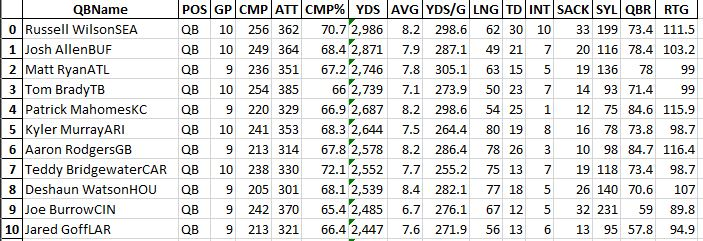
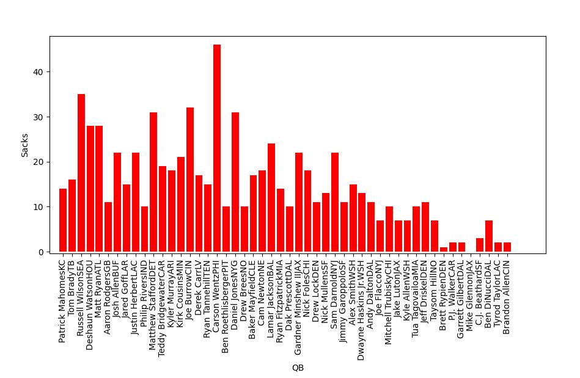

# ESPN NFL Data Analysis
Repo for web-scrapping and data analysis for ESPN/NFL stats

- Web-scraping(Python Beautiful Soup Package) program to parse HTML structures.
- Extracted various tables while also transferring data-frames to Excel worksheets for analysis. 
- Specialized SQL Queries are also integrated into this Python program to retrieve unique and customized NFL statistics from Excel.
- Produced data visualizations using Matplotlib python library.

### *Code executed after NFL sunday, MNF, TNF*

  - **[x] Current QB stats**
  - **[x] QB negatives (Sacks/Interceptions)**
  - **[x] Current Team standings**
  - **[x] NFL worst team/s**
  - **[x] Injuries**
  
 # Code & Resources 
 #### Python Version: 3.7
 #### Packages: pandas, BeautifulSoup, matplotlib
  
 # Web Scrapping Process:
  - Data structures utilized to manually scrape target HTML tables.
  - QB attributes scrapped from passing tables
    - **QBName	POS|GP|CMP|ATT|CMP%|YDS|AVG|YDS/G|LNG|TD|INT|SACK|SYL|QBR|RTG**
  - Injury attrbutes scrapped from injury tables
    - **Name|POS|DATE|COMMENTS**
  - Standing attributes scrapped from standings tables
    - **Teams|W|L|T|PCT|HOME|AWAY|DIV|CONF|PF|PA|DIFF|STRK**
   
 # SQL Queries:
 #### Multiple sub tables were generated from scrapped website data using queries
 #### Spreadsheets/Sub Tables:
  - Current stats 
  - Current Standings
  - Negatives
  - NFL worst
  - Injuries
  
# Excel and Dataframes:
##### All sub tables and scrapped data is stored into data structures and loaded into output excel sheet with multiple sheets for storage and easier readibility, along with future SQL queries. Original scrapped tables are also loaded into seperate excel file and used as reference/database for SQL/Python program.

# Data Visualization and Tables:
## Excel sheets parsed and cleaned for queries and visuals

## Demonstration of data visuals by comparing touchdowns and sacks

